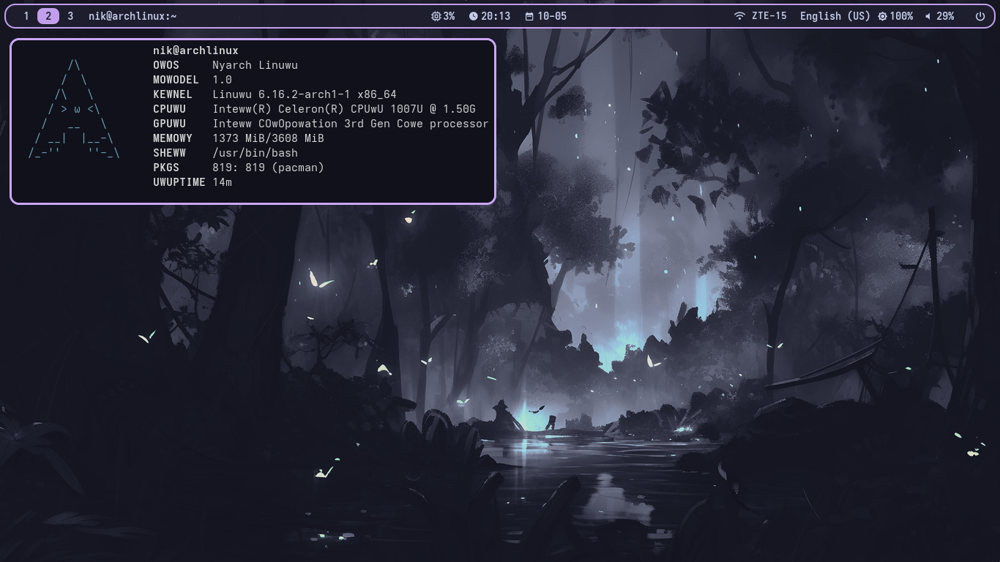

# This configs for PulseAudio, not Pipewire!

Dependencies: niri, yambar, networkmanager_dmenu, alacritty, swww, rofi, pulseaudio, otf-font-awesome, noto-fonts-emoji, random nerd font

1. Put powermenu.sh and powermenu-theme.rasi to your home directory
2. Put dark-forest.jpg to your home directory
3. Put text from 'My PS1' to your .bashrc or .zshrc (or other-shell-you-use.rc, xd)
4. Replace "nik" in configs to your username
5. Put rofi-power-menu to ~/.local/bin/
